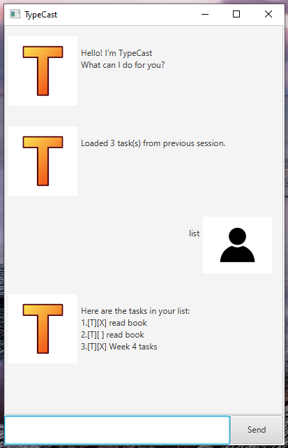

# TypeCast User Guide



**TypeCast** is a desktop task management application that helps you keep track of your todos, deadlines, and events through a simple chat interface. With TypeCast, managing your tasks is as easy as having a conversation!

## Quick Start

1. Ensure you have Java 17 or above installed on your computer.
2. Download the latest `typecast.jar` file from the releases page.
3. Double-click the file to start the application.
4. Type your commands in the text box at the bottom and press Enter or click Send.
5. Start managing your tasks!

---

## Features

> **Note about command format:**
> - Words in `<angle brackets>` are parameters you need to provide.
> - Items with `/prefix` are required format markers.
> - Dates should be in `YYYY-MM-DD` format (e.g., `2024-12-25`).
> - Times should be in 24-hour `HHmm` format (e.g., `1400` for 2:00 PM).
> - Date-only inputs will default to end-of-day (11:59 PM) for deadlines and start-of-day (12:00 AM) for events.

---

### Viewing all tasks: `list`

Shows all your tasks in a numbered list.

**Format:** `list`

**Example:**
```
list
```

**Expected output:**
```
Here are the tasks in your list:
1.[T][ ] read book
2.[D][ ] return book (by: Dec 31 2024, 11:59PM)
3.[E][ ] project meeting (from: Aug 06 2024, 2:00PM to: Aug 06 2024, 4:00PM)
```

---

### Adding a todo task: `todo`

Adds a simple todo task without any date/time.

**Format:** `todo <description>`

**Example:**
```
todo read book
```

**Expected output:**
```
Got it. I've added this task:
  [T][ ] read book
Now you have 1 tasks in the list.
```

---

### Adding a deadline: `deadline`

Adds a task that needs to be done by a specific date/time.

**Format:** `deadline <description> /by <date> [time]`

**Examples:**
```
deadline return book /by 2024-12-31
deadline submit report /by 2024-12-31 2359
```

**Expected output:**
```
Got it. I've added this task:
  [D][ ] return book (by: Dec 31 2024, 11:59PM)
Now you have 2 tasks in the list.
```

> **💡 Tip:** If you only provide a date without time, it defaults to 11:59 PM (end of day).

---

### Adding an event: `event`

Adds a task that happens during a specific time period.

**Format:** `event <description> /from <start date> [time] /to <end date> [time]`

**Examples:**
```
event project meeting /from 2024-08-06 1400 /to 2024-08-06 1600
event conference /from 2024-12-01 /to 2024-12-03
```

**Expected output:**
```
Got it. I've added this task:
  [E][ ] project meeting (from: Aug 06 2024, 2:00PM to: Aug 06 2024, 4:00PM)
Now you have 3 tasks in the list.
```

---

### Adding a period task: `period`

Adds a task that should be completed within a time period (similar to event but semantically different).

**Format:** `period <description> /within <start date> [time] /to <end date> [time]`

**Example:**
```
period complete assignment /within 2024-12-01 /to 2024-12-15
```

**Expected output:**
```
Got it. I've added this task:
  [P][ ] complete assignment (period: Dec 01 2024, 12:00AM to Dec 15 2024, 12:00AM)
Now you have 4 tasks in the list.
```

---

### Marking a task as done: `mark`

Marks a task as completed.

**Format:** `mark <task number>`

**Example:**
```
mark 1
```

**Expected output:**
```
Nice! I've marked this task as done:
  [T][X] read book
```

---

### Unmarking a task: `unmark`

Marks a completed task as not done.

**Format:** `unmark <task number>`

**Example:**
```
unmark 1
```

**Expected output:**
```
OK, I've marked this task as not done yet:
  [T][ ] read book
```

---

### Finding tasks: `find`

Searches for tasks that contain a specific keyword.

**Format:** `find <keyword>`

**Example:**
```
find book
```

**Expected output:**
```
Here are the matching tasks in your list:
1.[T][ ] read book
2.[D][ ] return book (by: Dec 31 2024, 11:59PM)
```

> **💡 Tip:** The search is case-insensitive, so "book", "Book", and "BOOK" will all match.

---

### Deleting a task: `delete`

Removes a task from your list permanently.

**Format:** `delete <task number>`

**Example:**
```
delete 2
```

**Expected output:**
```
Noted. I've removed this task:
  [D][ ] return book (by: Dec 31 2024, 11:59PM)
Now you have 2 tasks in the list.
```

---

### Exiting the application: `bye`

Closes the TypeCast application.

**Format:** `bye`

**Example:**
```
bye
```

**Expected output:**
```
Bye. Hope to see you again soon!
```

> The application window will close automatically after a moment.

---

## Task Type Reference

| Symbol | Task Type | Description |
|--------|-----------|-------------|
| `[T]` | Todo | Simple task without date/time |
| `[D]` | Deadline | Task with a due date |
| `[E]` | Event | Task with start and end time |
| `[P]` | Period | Task to be done within a time period |

| Symbol | Status | Description |
|--------|--------|-------------|
| `[ ]` | Not Done | Task is incomplete |
| `[X]` | Done | Task is completed |

---

## Data Storage

- Your tasks are automatically saved to `./data/tasks.txt` after every change.
- The data file is created automatically if it doesn't exist.
- Tasks are automatically loaded when you start TypeCast.
- **⚠️ Warning:** Do not manually edit the data file as it may cause data corruption.

---

## Error Messages

TypeCast provides helpful error messages when something goes wrong:

| Error Message | Cause | Solution |
|--------------|-------|----------|
| `The description of a todo cannot be empty.` | No description after `todo` | Provide a description: `todo read book` |
| `The format of deadline should be: deadline <description> /by <date/time>` | Missing `/by` in deadline | Use correct format: `deadline task /by 2024-12-31` |
| `Invalid date format. Please use yyyy-MM-dd or yyyy-MM-dd HHmm` | Wrong date format | Use `2024-12-31` or `2024-12-31 1400` |
| `Invalid task number. Please enter a valid number.` | Task number is not a number | Enter a valid number (1, 2, 3, etc.) |
| `Task index out of range.` | Task number doesn't exist | Use `list` to see valid task numbers |
| `Sorry, that is not a valid command!` | Unknown command | Check spelling or see Features section |

---

## Tips for Best Experience

1. **Use descriptive task names** - Instead of "meeting", try "project status meeting with team"
2. **Be specific with dates** - Include both date and time for better scheduling
3. **Regular reviews** - Use `list` frequently to see what needs to be done
4. **Search effectively** - Use `find` with specific keywords to locate tasks quickly
5. **Clean up completed tasks** - Delete old tasks with `delete` to keep your list manageable

---

## FAQ

**Q: Can I edit a task after creating it?**  
A: Currently, you need to delete the task and create a new one. Delete the old task with `delete <number>` and add a new one.

**Q: What happens if I close the app without typing `bye`?**  
A: Your tasks are saved automatically after each command, so your data is safe!

**Q: Can I use natural language dates like "tomorrow" or "next week"?**  
A: Not yet. Please use the `YYYY-MM-DD` format (e.g., `2024-12-31`).

**Q: Where is my data stored?**  
A: In the `./data/tasks.txt` file in the same folder as the application.

**Q: Can I backup my tasks?**  
A: Yes! Simply copy the `./data/tasks.txt` file to another location.

---

## Command Summary

| Command | Format | Example |
|---------|--------|---------|
| List | `list` | `list` |
| Todo | `todo <description>` | `todo read book` |
| Deadline | `deadline <desc> /by <date> [time]` | `deadline return book /by 2024-12-31` |
| Event | `event <desc> /from <start> /to <end>` | `event meeting /from 2024-08-06 1400 /to 2024-08-06 1600` |
| Period | `period <desc> /within <start> /to <end>` | `period project /within 2024-12-01 /to 2024-12-15` |
| Mark | `mark <number>` | `mark 1` |
| Unmark | `unmark <number>` | `unmark 1` |
| Find | `find <keyword>` | `find book` |
| Delete | `delete <number>` | `delete 2` |
| Exit | `bye` | `bye` |

---

## Contact & Support

If you encounter any issues or have suggestions for improvement, please feel free to open an issue on the project repository.

**Happy task managing with TypeCast!** 🎯